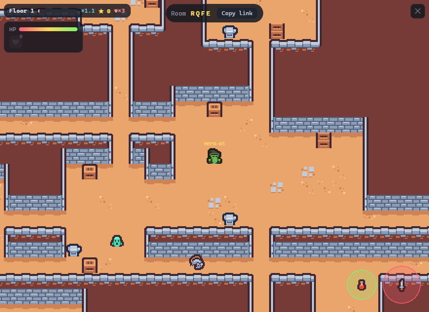
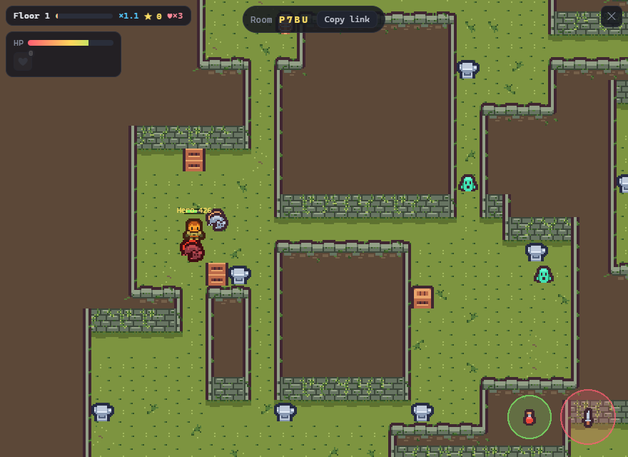
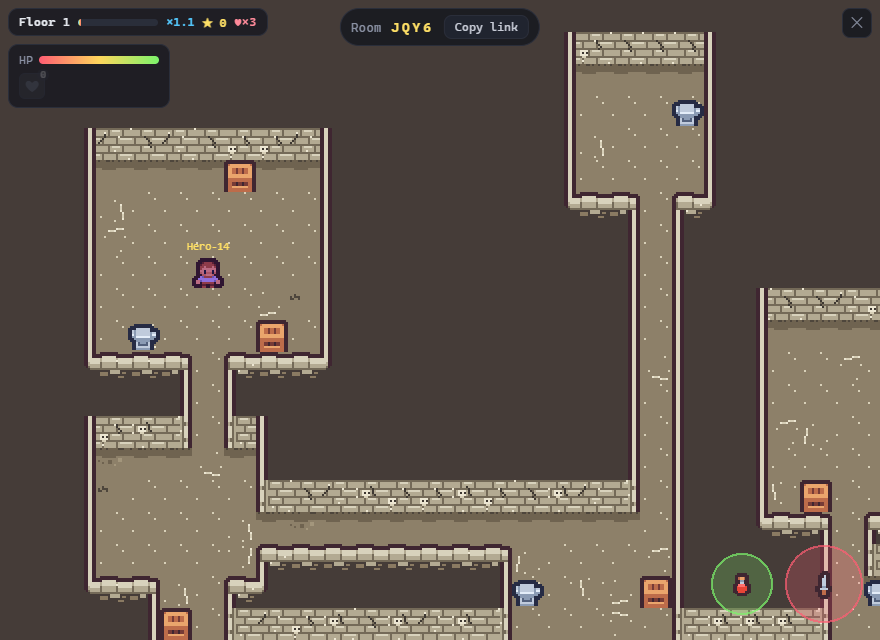
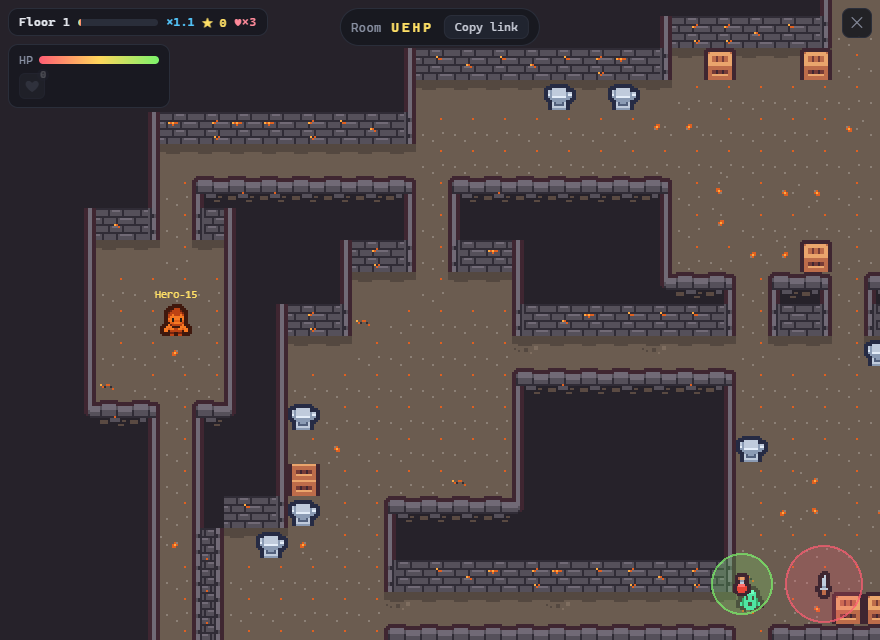

# Dungeon Crawler (working title)

A co-op, top-down, real-time dungeon crawler. The whole thing runs in the
browser — easy to share with a link, plays on a phone, no installer.

Dive as a team. Staying on a floor floods you with monsters; descending
multiplies your score. A party wipe ends the run — how deep can you get?

## The descent

Depth changes the dungeon: every few floors the party crosses into a new
biome. Same brutal arcade dive, different place.

| Stone halls (floors 1–4) | Overgrown (floors 5–9) |
|---|---|
|  |  |

| Crypt (floors 10–14) | Ember depths (floors 15+) |
|---|---|
|  |  |

On top of the biomes: dark floors where you fight inside your own lantern
light, torchlit floors with secrets hiding in the shadows between sconces, a
timed vault chest guarding named relics, and a score screen that remembers
what you discovered.

**Stack**

- **Client:** Phaser 3.90 + TypeScript + Vite
- **Server:** Colyseus 0.17 (authoritative multiplayer) + TypeScript
- The **server is the source of truth** for movement, geometry, and (later)
  combat and loot. Clients send input; the server simulates and broadcasts
  state; clients render and interpolate.

---

## Quick start (first time)

You need **Node.js 18+** installed. From this folder:

```bash
npm run setup     # installs root + server + client dependencies
npm run dev       # starts BOTH the server and the client together
```

Then open **http://localhost:5173** in your browser.
To test co-op, open a **second tab** (or another browser) at the same URL —
you'll see a second hero appear, and you'll both move around the same room in
real time.

Controls: **WASD** or **arrow keys** to move. Your hero has a yellow ring.

> Prefer two terminals? Run `npm run dev:server` in one and
> `npm run dev:client` in another.

### Dev overrides (for testing)

The server reads a few env vars that **force** normally-random or depth-gated
choices, so you can jump straight to the thing you want to see. All are unset in
prod; an invalid value is ignored and the game behaves normally.

| Variable | Forces | Values |
|---|---|---|
| `DUNGEON_BIOME` | The biome tile kit on every floor (incl. the special kits that aren't in the depth bands) | `stone` `overgrown` `crypt` `ember` `frost` `goldvault` `flesh` |
| `DUNGEON_LIGHTING` | The lighting mode on every floor (overrides "floor 1 is always bright") | `bright` `dark` `torchlit` |
| `DUNGEON_SEED` | The base seed → **the whole run is reproducible** floor-for-floor; restart replays the identical run | any integer |
| `DUNGEON_STAIRWAY` | A strange stairway on **every** floor (skips both its ~1-in-4 roll and the "never on floor 1" rule), so the goldvault detour is reachable without reroll-fishing | `always` |
| `PORT` | The server port | default `2567` |

```bash
# Git Bash — one-shot (only this run)
DUNGEON_BIOME=goldvault DUNGEON_SEED=12345 npm run dev
```
```powershell
# PowerShell — persists for the terminal; clear with `Remove-Item Env:DUNGEON_BIOME`
$env:DUNGEON_BIOME='ember'; npm run dev
```

The server logs a line per floor — `Floor 1 — preset: hall, lighting: bright,
biome: ember (seed 627383556)` — so you can confirm an override took effect (a
typo'd value silently falls back to normal). The line also names a `strange
stairway` when the floor has one, and marks the goldvault side trip itself as
`Floor 1 [vault detour]`.

---

## What's in here

```
dungeon-crawler-game/
├── server/                 Colyseus authoritative server
│   └── src/
│       ├── index.ts            boots the server on :2567
│       └── rooms/
│           ├── DungeonRoom.ts  join/leave, input, movement simulation
│           ├── map.ts          the dungeon grid (source of truth)
│           └── schema/
│               └── DungeonState.ts   networked state (players)
├── client/                 Phaser browser client
│   └── src/
│       ├── main.ts             Phaser game bootstrap
│       ├── config.ts           server URL, tile size, etc.
│       └── scenes/
│           └── GameScene.ts    connect, render map, render+interpolate players, input
├── ATTRIBUTION.md          asset credits (kept current as we add art)
├── CLAUDE.md               context for Claude Code sessions
└── package.json            setup / dev / build scripts
```

---

## Where the game is

Well past the skeleton: it's a mobile-first arcade co-op dive — mob pressure
that ramps with time on the floor, heat-multiplied scoring, lives / revives /
party wipes, a timed vault chest with procedurally named relics, Quick Play
matchmaking, floor-lighting variety (dark + torchlit), depth biomes, and a
local codex of personal bests. The single source of truth for what's built
and what's next is [docs/roadmap.md](docs/roadmap.md).

---

## Deploying later

- **Client** is a static site (`npm --prefix client run build` → `client/dist`).
  Host it anywhere (itch.io, Netlify, GitHub Pages). Set `VITE_SERVER_URL` at
  build time to point at your deployed server (use `wss://` in production).
- **Server** is a normal Node process (`npm --prefix server run build` then
  `node server/dist/index.js`). Colyseus has guides for hosting it.
